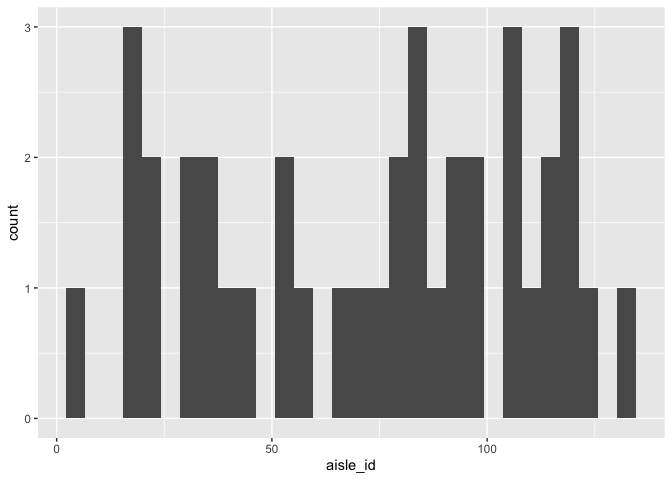
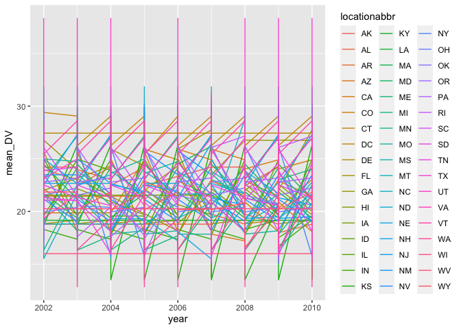
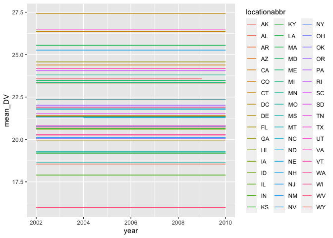
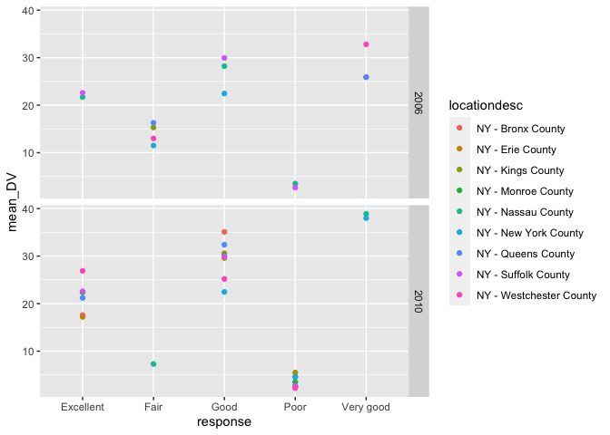
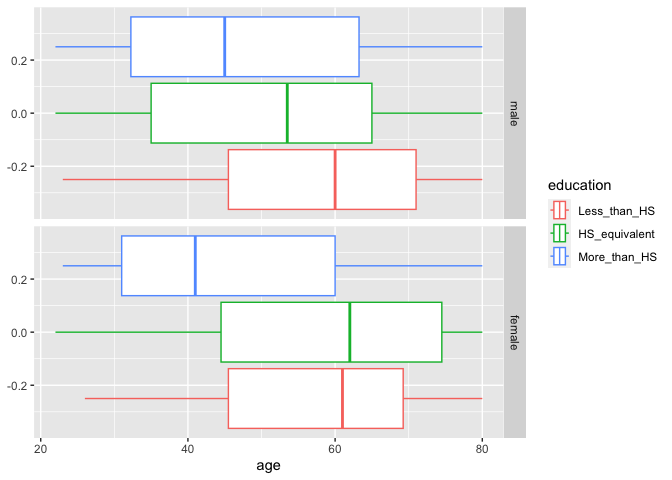
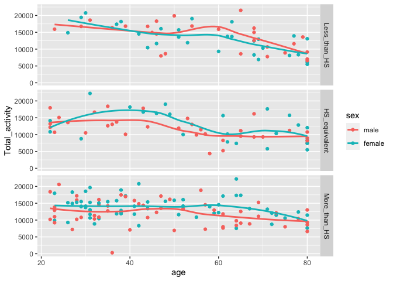
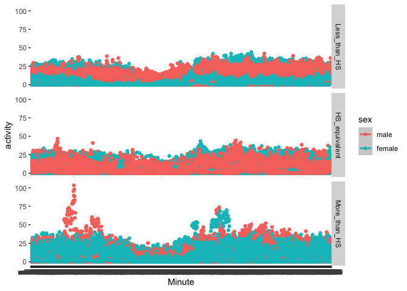

p8105_hw3_jl5934
================
Jesus Luevano
2023-10-06

``` r
library(tidyverse)
```

    ## ── Attaching core tidyverse packages ──────────────────────── tidyverse 2.0.0 ──
    ## ✔ dplyr     1.1.3     ✔ readr     2.1.4
    ## ✔ forcats   1.0.0     ✔ stringr   1.5.0
    ## ✔ ggplot2   3.4.3     ✔ tibble    3.2.1
    ## ✔ lubridate 1.9.2     ✔ tidyr     1.3.0
    ## ✔ purrr     1.0.2     
    ## ── Conflicts ────────────────────────────────────────── tidyverse_conflicts() ──
    ## ✖ dplyr::filter() masks stats::filter()
    ## ✖ dplyr::lag()    masks stats::lag()
    ## ℹ Use the conflicted package (<http://conflicted.r-lib.org/>) to force all conflicts to become errors

``` r
library(p8105.datasets)
data("instacart")
data("brfss_smart2010")
```

# Problem 1

## Describing the dataset

- There are 1384617 rows and 15 columns in the `instacart` dataframe.

- The variables included are order_id, product_id, add_to_cart_order,
  reordered, user_id, eval_set, order_number, order_dow,
  order_hour_of_day, days_since_prior_order, product_name, aisle_id,
  department_id, aisle, department.

- There are 134 aisles in the dataframe.

``` r
instacart %>%
  group_by(aisle_id) %>%
  summarize(n_obs = n()) %>%
  arrange(desc(n_obs))
```

    ## # A tibble: 134 × 2
    ##    aisle_id  n_obs
    ##       <int>  <int>
    ##  1       83 150609
    ##  2       24 150473
    ##  3      123  78493
    ##  4      120  55240
    ##  5       21  41699
    ##  6      115  36617
    ##  7       84  32644
    ##  8      107  31269
    ##  9       91  26240
    ## 10      112  23635
    ## # ℹ 124 more rows

- The top 3 aisles from where purchases are ordered from are Aisle 83
  (150609 purchases), 24 (150473 purchases), and 123 (78493 purchases).

``` r
instacart %>%
  group_by(aisle_id) %>%
  summarize(n_obs = n()) %>%
  filter(n_obs > 10000) %>%
  arrange(desc(n_obs)) %>%
  ggplot(aes(x = aisle_id)) +
  geom_histogram()
```

    ## `stat_bin()` using `bins = 30`. Pick better value with `binwidth`.

<!-- -->

``` r
instacart %>%
  filter(aisle == c("baking ingredients", "dog food care", "packaged vegetables fruits")) %>%
  group_by(aisle, product_name) %>%
  summarize(n_obs = n()) %>%
  arrange(desc(n_obs)) %>%
  slice_max(order_by = n_obs, n = 3)
```

    ## `summarise()` has grouped output by 'aisle'. You can override using the
    ## `.groups` argument.

    ## # A tibble: 9 × 3
    ## # Groups:   aisle [3]
    ##   aisle                      product_name                                  n_obs
    ##   <chr>                      <chr>                                         <int>
    ## 1 baking ingredients         Light Brown Sugar                               157
    ## 2 baking ingredients         Pure Baking Soda                                140
    ## 3 baking ingredients         Organic Vanilla Extract                         122
    ## 4 dog food care              Organix Grain Free Chicken & Vegetable Dog F…    14
    ## 5 dog food care              Organix Chicken & Brown Rice Recipe              13
    ## 6 dog food care              Original Dry Dog                                  9
    ## 7 packaged vegetables fruits Organic Baby Spinach                           3324
    ## 8 packaged vegetables fruits Organic Raspberries                            1920
    ## 9 packaged vegetables fruits Organic Blueberries                            1692

``` r
instacart %>%
  filter(product_name == c("Pink Lady Apples", "Coffee Ice Cream")) %>%
  group_by(product_name, order_dow) %>%
  summarize(Mean = mean(order_hour_of_day, na.rm = TRUE)) %>%
  pivot_wider(
    names_from = order_dow,
    values_from = Mean
  )
```

    ## Warning: There was 1 warning in `filter()`.
    ## ℹ In argument: `product_name == c("Pink Lady Apples", "Coffee Ice Cream")`.
    ## Caused by warning in `product_name == c("Pink Lady Apples", "Coffee Ice Cream")`:
    ## ! longer object length is not a multiple of shorter object length

    ## `summarise()` has grouped output by 'product_name'. You can override using the
    ## `.groups` argument.

    ## # A tibble: 2 × 8
    ## # Groups:   product_name [2]
    ##   product_name       `0`   `1`   `2`   `3`   `4`   `5`   `6`
    ##   <chr>            <dbl> <dbl> <dbl> <dbl> <dbl> <dbl> <dbl>
    ## 1 Coffee Ice Cream  13.2  15    15.3  15.4  15.2  10.3  12.4
    ## 2 Pink Lady Apples  12.2  11.7  12    13.9  11.9  13.9  11.6

# Problem 2

``` r
BRFSS <- brfss_smart2010 %>%
  janitor::clean_names() %>%
  filter(topic == "Overall Health") %>%
  mutate(response = response %>%
           fct_recode("Poor" = "Poor", "Fair" = "Fair", "Good" = "Good", "Very good" = "Very good", "Excellent" = "Excellent")) 
```

``` r
BRFSS %>%
  filter(year == 2002) %>%
  group_by(locationabbr) %>%
  summarize(n_obs = n()) %>%
  filter(n_obs > 7)
```

    ## # A tibble: 36 × 2
    ##    locationabbr n_obs
    ##    <chr>        <int>
    ##  1 AZ              10
    ##  2 CO              20
    ##  3 CT              35
    ##  4 DE              15
    ##  5 FL              35
    ##  6 GA              15
    ##  7 HI              20
    ##  8 ID              10
    ##  9 IL              15
    ## 10 IN              10
    ## # ℹ 26 more rows

There are 36 states with ore than 7 observations in 2002.

``` r
BRFSS %>%
  filter(year == 2010) %>%
  group_by(locationabbr) %>%
  summarize(n_obs = n()) %>%
  filter(n_obs > 7)
```

    ## # A tibble: 45 × 2
    ##    locationabbr n_obs
    ##    <chr>        <int>
    ##  1 AL              15
    ##  2 AR              15
    ##  3 AZ              15
    ##  4 CA              60
    ##  5 CO              35
    ##  6 CT              25
    ##  7 DE              15
    ##  8 FL             205
    ##  9 GA              20
    ## 10 HI              20
    ## # ℹ 35 more rows

There are 45 states with ore than 7 observations in 2010.

``` r
BRFSS %>%
  janitor::clean_names() %>%
  filter(response == "Excellent") %>%
  group_by(locationabbr, locationdesc) %>%
  mutate(mean_DV = mean(data_value)) %>%
  select(year, locationabbr, locationdesc, mean_DV) %>%
  ggplot(aes(x = year, y = mean_DV, group = locationabbr)) + 
  geom_line(aes(color=locationabbr))
```

    ## Warning: Removed 1 row containing missing values (`geom_line()`).

<!-- -->

``` r
BRFSS %>%
  janitor::clean_names() %>%
  filter(response == "Excellent") %>%
  group_by(locationabbr) %>%
  mutate(mean_DV = mean(data_value)) %>%
  select(year, locationabbr, mean_DV) %>%
  ggplot(aes(x = year, y = mean_DV, group = locationabbr)) + 
  geom_line(aes(color=locationabbr))
```

    ## Warning: Removed 398 rows containing missing values (`geom_line()`).

<!-- -->

``` r
p <- brfss_smart2010 %>%
  janitor::clean_names() %>%
  filter(year == c("2006", "2010"), locationabbr == "NY", topic == "Overall Health") %>%
  group_by(response, locationdesc) %>%
  mutate(mean_DV = mean(data_value)) %>%
  ggplot(aes(x= response, y = mean_DV, color = locationdesc)) + 
  geom_point() 
```

    ## Warning: There was 1 warning in `filter()`.
    ## ℹ In argument: `year == c("2006", "2010")`.
    ## Caused by warning in `year == c("2006", "2010")`:
    ## ! longer object length is not a multiple of shorter object length

``` r
p + facet_grid(rows = vars(year))
```

<!-- -->

# Problem 3

``` r
accel.df <- read_csv("p8105_hw3_jl5934_files/data/nhanes_accel.csv") %>%
  janitor::clean_names()
```

    ## Rows: 250 Columns: 1441
    ## ── Column specification ────────────────────────────────────────────────────────
    ## Delimiter: ","
    ## dbl (1441): SEQN, min1, min2, min3, min4, min5, min6, min7, min8, min9, min1...
    ## 
    ## ℹ Use `spec()` to retrieve the full column specification for this data.
    ## ℹ Specify the column types or set `show_col_types = FALSE` to quiet this message.

``` r
covar.df <- read_csv("p8105_hw3_jl5934_files/data/nhanes_covar.csv",
                     skip = 4) %>%
  janitor::clean_names() %>%
  filter(age > 21) %>%
  na.omit() %>%
  mutate(education = as.factor(education) %>%
           fct_recode("Less_than_HS" = "1", "HS_equivalent" = "2", "More_than_HS" = "3")) %>%
  mutate(sex = as.factor(sex) %>% 
           fct_recode("male" = "1", "female" = "2"))
```

    ## Rows: 250 Columns: 5
    ## ── Column specification ────────────────────────────────────────────────────────
    ## Delimiter: ","
    ## dbl (5): SEQN, sex, age, BMI, education
    ## 
    ## ℹ Use `spec()` to retrieve the full column specification for this data.
    ## ℹ Specify the column types or set `show_col_types = FALSE` to quiet this message.

``` r
accel_covar.df <- inner_join(covar.df, accel.df, by = "seqn")
  
accel_covar.df %>%
  group_by(sex, education) %>%
  summarize(n_obs = n())
```

    ## `summarise()` has grouped output by 'sex'. You can override using the `.groups`
    ## argument.

    ## # A tibble: 6 × 3
    ## # Groups:   sex [2]
    ##   sex    education     n_obs
    ##   <fct>  <fct>         <int>
    ## 1 male   Less_than_HS     27
    ## 2 male   HS_equivalent    34
    ## 3 male   More_than_HS     54
    ## 4 female Less_than_HS     28
    ## 5 female HS_equivalent    23
    ## 6 female More_than_HS     59

Making plot of age distribution by education level and sex

``` r
q <- accel_covar.df %>%
  group_by(sex, education) %>%
  ggplot(aes(x = age, color = education)) +
  geom_boxplot()

q + facet_grid(rows = vars(sex))
```

<!-- -->

``` r
r <- accel_covar.df %>%
  mutate(Total_activity = rowSums(.[6:1445])) %>%
  ggplot(aes(x = age, y = Total_activity, color = sex)) +
  geom_point() + 
  geom_smooth(se= FALSE)

r + facet_grid(rows = vars(education))
```

    ## `geom_smooth()` using method = 'loess' and formula = 'y ~ x'

<!-- -->

``` r
s <- accel_covar.df %>%
  pivot_longer(min1:min1440,
    names_to = "Minute", values_to = "activity") %>%
  ggplot(aes(x = Minute, y = activity, color= sex)) +
  geom_point() +
  geom_smooth(se = TRUE)

s + facet_grid(rows = vars(education))
```

    ## `geom_smooth()` using method = 'loess' and formula = 'y ~ x'

<!-- -->
